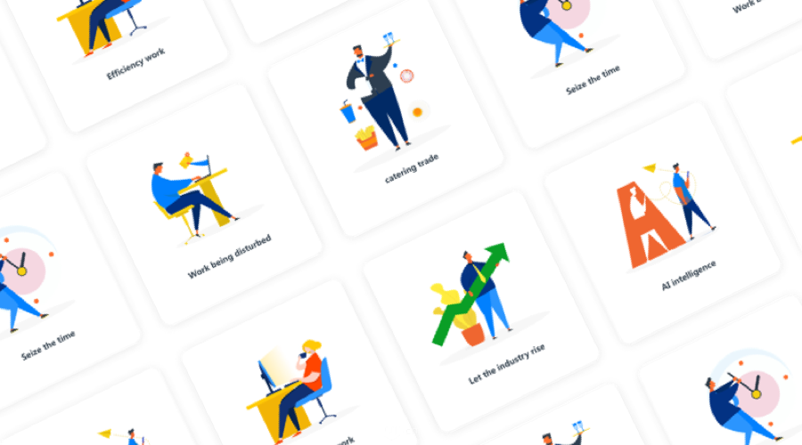
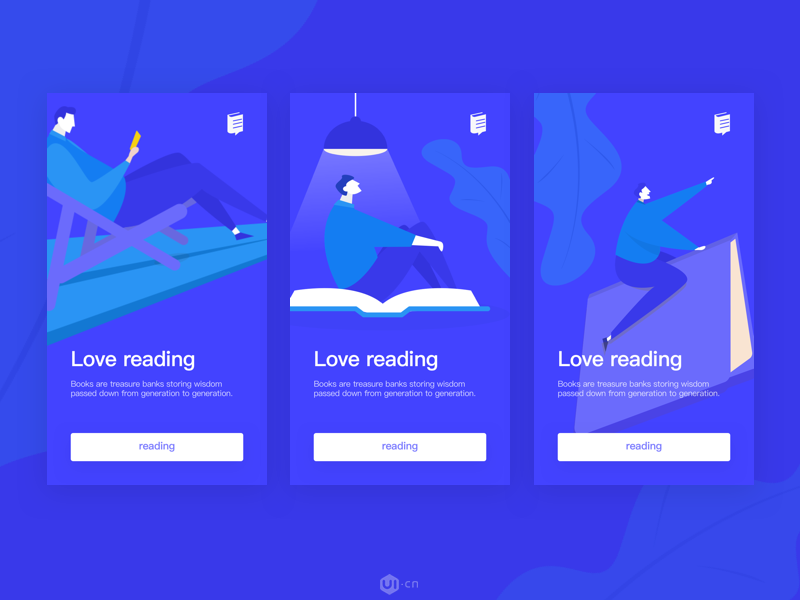
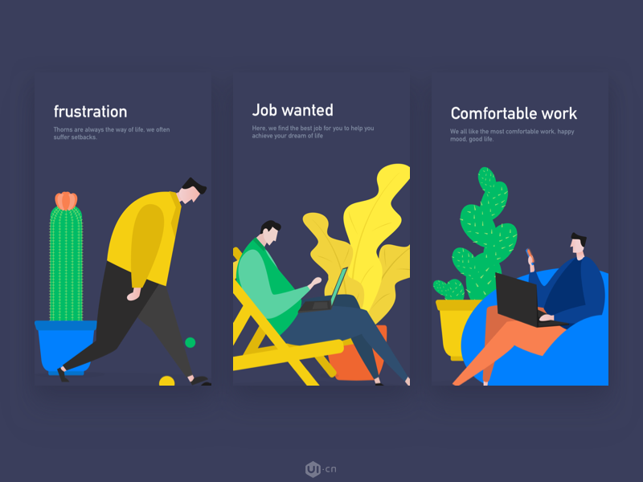
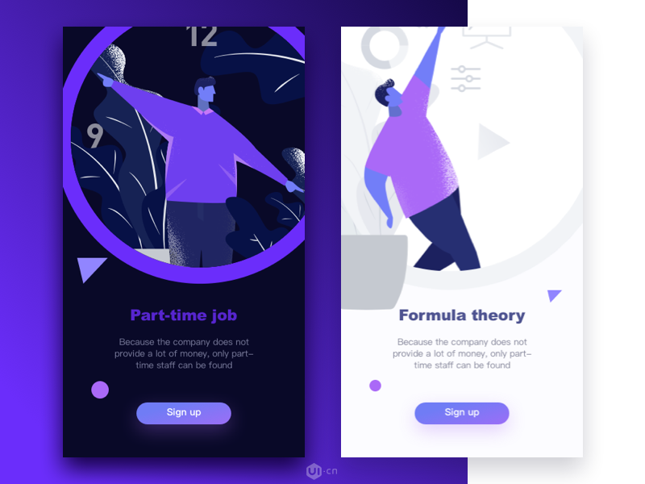
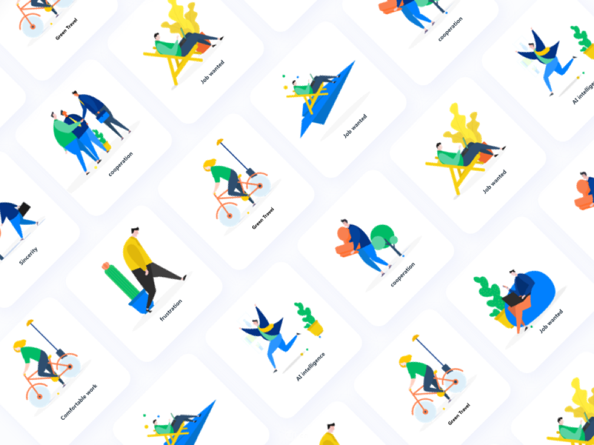
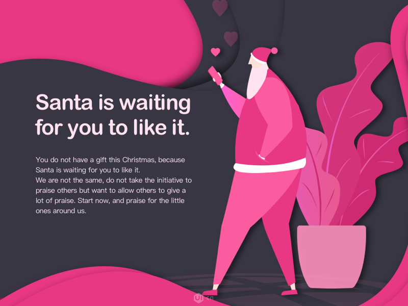
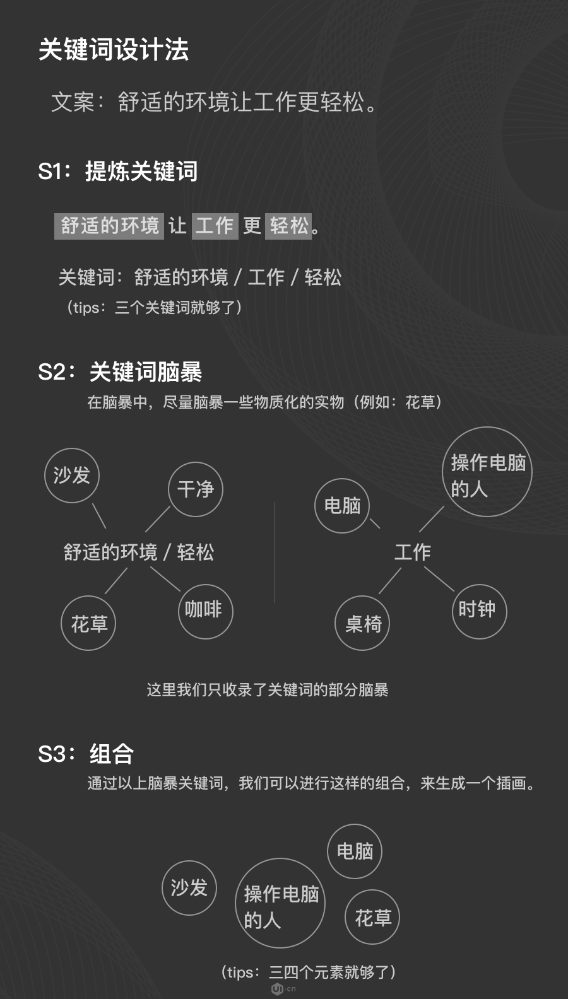

矢量人物插画在UI设计中的地位不对攀升。

DCU设计团队联合成员erics与你分享如何打造属于自己的人物插画，无论你是科班出身还是行业小白，都可轻松学会。

我们可以很深刻的感受到最近矢量人物插画在各互联网巨头产品中的使用，甚至苹果的发布会都开始使用矢量人物插画，同时我们可以看到追波上越来越多的设计师开始深耕于此，最近我们的一些朋友想了解下我们团队里，erics笔下的人物是如何创作的。借此机会，我们与erics合作为大家带来一个全面的设计教程，帮助大家打造自己的矢量人物插画。

erics追波链接：[https://dribbble.com/ericsun](https://dribbble.com/ericsun)

erics微信：xiaoqigesun

今天很荣幸和大家一起探讨：

### 如何10分钟內画好这样的人物

我们再看几幅，看下里边人物的特征，人物形象简单协调，用色鲜明。

## 为什么有这样的人物出现？

目前我们团队里的UI设计师erics就职于亚太区领先的劳动力管理软件厂商：盖雅工场。由于盖雅工场是一家ToB型企业，研发的软件主要面向大型劳动力企业，类似于NIKE，通用，雅诗兰黛等世界500强企业，所以需要一批简约的人物形象用于市场宣传，物料制作上。

我们直接进入正题。

## 怎么画这样的人物

### 1. 画之前的准备

erics：我们无论在UI，还是市场物料的设计上，首先要弄清楚我们的设计场景，这个最基本的点其实很多人会忽略，在设计之前，我们是否真的了解我们的受众是谁或用户画像，我们的设计作品将用于什么样的场景，我希望大家在设计之前先明确此类问题。

### 2. 关键词设计法

eircs：关键词设计法是我们在团队里推行的一种设计方法，由于我们的产品没有硬件支撑，（比如小米手机，可以在海报里填充手机来使页面饱满）所以更多的时候我们需要设计一个场景来给用户传递我们的思想，这时候我们可以通过关键词设计法来设计。

### 什么是关键词设计法？

我们通过已有的设计文案，从文案中提炼出关键词，通过对关键词进行脑暴后形成具体物质化形象的设计方法。

